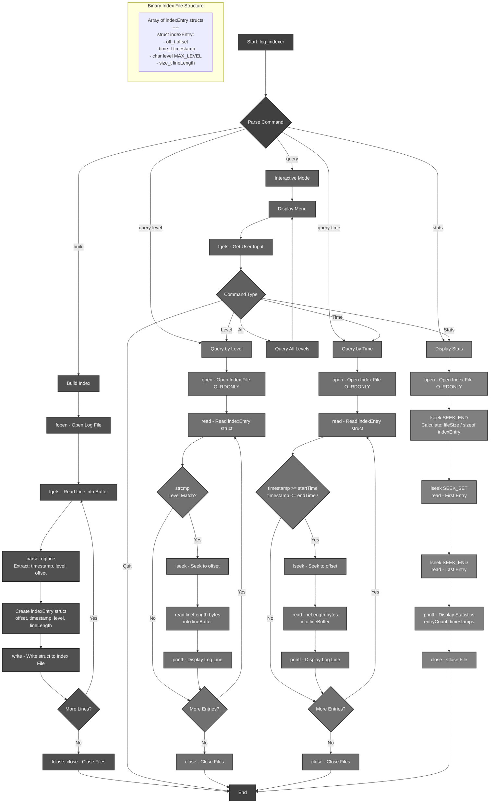

# Log File Indexer

A fast and efficient C-based log file indexer that enables quick querying of large log files by building an index for rapid lookups by log level and time range.

## Table of Contents
- [Features](#features)
- [Project Structure](#project-structure)
- [Building](#building)
  - [Prerequisites](#prerequisites)
  - [Compile](#compile)
  - [Quick Start](#quick-start)
  - [Other Make Targets](#other-make-targets)
- [Usage](#usage)
  - [Build an Index](#build-an-index)
  - [Interactive Query Mode](#interactive-query-mode)
  - [Query by Log Level](#query-by-log-level)
  - [Query by Time Range](#query-by-time-range)
  - [View Index Statistics](#view-index-statistics)
- [Log File Format](#log-file-format)
- [How It Works](#how-it-works)
- [Program Flow](#program-flow)
- [Performance](#performance)
- [Troubleshooting](#troubleshooting)

## Features

- **Fast Index Building**: Creates a binary index file for quick log retrieval
- **Query by Log Level**: Filter logs by severity (DEBUG, INFO, WARN, ERROR, CRITICAL, FATAL)
- **Query by Time Range**: Search logs within specific time periods
- **Interactive Mode**: User-friendly CLI for exploring logs
- **Index Statistics**: View metadata about your indexed logs
- **Zero Dependencies**: Pure C implementation with standard libraries

## Project Structure

```
.
├── include/
│   ├── cli.h            # CLI interface declarations
│   └── index.h          # Core indexing structures and functions
├── src/
│   ├── main.c           # Entry point and command dispatcher
│   ├── index-builder.c  # Index creation logic
│   ├── query.c          # Query processing functions
│   └── cli.c            # Interactive CLI implementation
├── Makefile             # Build configuration
├── .gitignore           # Git ignore rules
├── README.md            # Project Documentation
└── sample.log           # Sample log file for testing
```

## Building

### Prerequisites
- GCC compiler
- Make

### Compile
```bash
make
```

This creates the `log_indexer` executable in the project root.

### Quick Start
To quickly test the indexer with the included sample log file:
```bash
make run
```

This will build the project, create an index from `sample.log`, and launch the interactive query mode where you can explore different log levels and time ranges.

### Other Make Targets
```bash
make clean      # Remove build artifacts
make rebuild    # Clean and rebuild
make run        # Run interactive query mode with sample.log
make test       # Run basic functionality tests
make install    # Install to /usr/local/bin (requires sudo)
make uninstall  # Remove from /usr/local/bin
make help       # Show all available commands
```

## Usage

### Build an Index
```bash
./log_indexer build <logfile> <indexfile>
```
Example:
```bash
./log_indexer build sample.log logs.idx
```

### Interactive Query Mode
```bash
./log_indexer query <logfile> <indexfile>
```
Example:
```bash
./log_indexer query sample.log logs.idx
```

In interactive mode, you can:
- Type a log level (e.g., `ERROR`, `INFO`) to filter logs
- Type `stats` to view index statistics
- Type `all` to see logs from all levels
- Type `time` to search by time range
- Type `quit` to exit

### Query by Log Level
```bash
./log_indexer query-level <logfile> <indexfile> <level>
```
Example:
```bash
./log_indexer query-level sample.log logs.idx ERROR
```

### Query by Time Range
```bash
./log_indexer query-time <logfile> <indexfile> <start_time> <end_time>
```
Time format: `YYYY-MM-DD-HH:MM:SS`

Example:
```bash
./log_indexer query-time sample.log logs.idx 2025-12-10-00:00:00 2025-12-10-12:00:00
```

### View Index Statistics
```bash
./log_indexer stats <indexfile>
```
Example:
```bash
./log_indexer stats logs.idx
```

## Log File Format

The indexer expects log files in the following format:
```
YYYY-MM-DD HH:MM:SS [LEVEL] Log message content
```

Example:
```
2025-12-10 00:00:00 [INFO] System startup initiated - build v2.4.1.
2025-12-10 07:00:08 [ERROR] Failed to connect to external API: timeout after 30s.
```

Supported log levels: DEBUG, INFO, WARN, ERROR, CRITICAL, FATAL

## How It Works

1. **Index Building**: The indexer scans the log file and creates a binary index containing:
   - File offset of each log line
   - Timestamp
   - Log level
   - Line length

2. **Querying**: Instead of scanning the entire log file, queries use the index to jump directly to relevant log entries, making searches extremely fast even for large files.

3. **Storage**: The index file (`.idx`) is a binary file containing an array of `indexEntry` structures, enabling efficient random access.

## Program Flow



## Performance

- **Index building**: One-time operation per log file - scans entire file once
- **Query complexity**: O(n) where n is the number of index entries (not log file size)
- **Binary index advantage**: Each index entry is fixed-size (sizeof `indexEntry`), enabling:
  - Sequential binary reads with minimal overhead
  - Direct file seeking using `lseek` with calculated offsets
  - No parsing overhead during queries (timestamps and levels already extracted)
- **Memory efficiency**: Minimal memory footprint - only one log line in memory at a time
- **Fast log retrieval**: Direct seeking to log file positions eliminates sequential scanning

## Troubleshooting

### Index file not found

If you see `failed to open index file!`, make sure you've built the index first:
```bash
./log_indexer build sample.log logs.idx
```

### Log file parsing errors

If no entries are created or you get fewer entries than expected, verify your log file follows the correct format:
```
YYYY-MM-DD HH:MM:SS [LEVEL] Message
```
Each log line must start with a timestamp and log level in brackets.

### Invalid time format

When querying by time, use the format `YYYY-MM-DD-HH:MM:SS`:
```bash
./log_indexer query-time sample.log logs.idx 2025-12-10-00:00:00 2025-12-10-12:00:00
```
Note the hyphens between date components and colons between time components.

### Permission denied errors

Check file permissions and ensure you have:
- Read access to the log file: `ls -l sample.log`
- Write access to the directory for creating the index file

### No matching entries found

If your query returns 0 results when you expect matches:
- **Command-line queries** (`query-level`) are case-sensitive: use `ERROR` not `error`
- **Interactive mode** automatically converts input to uppercase, so any case works
- For time queries, verify your time range includes the logs you're looking for
- Use the `stats` command to check the index time range:
  ```bash
  ./log_indexer stats logs.idx
  ```

### Compilation errors on Windows

The code includes Windows compatibility with `O_BINARY`. If you encounter undefined symbols, ensure you're using a GCC-compatible compiler like MinGW, or compile manually:
```bash
gcc -Wall -Wextra -Iinclude src/*.c -o log_indexer
```

### Interactive mode issues

In interactive mode:
- Commands are case-insensitive, but log levels should be uppercase (ERROR, INFO, etc.)
- Press Enter after typing your command
- Type `quit` or `exit` to leave interactive mode
